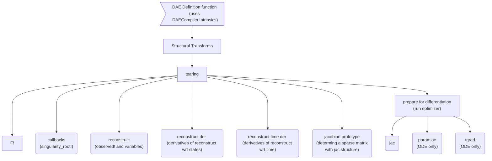

# DAECompiler

This package implements a prototype compiler for Differential Algebraic Equations
(DAEs), by re-using the Julia compiler infrastructure as much as possible.
Basically we take in a representation of the DAE and compile it every which way,
to generate all the things (jacobians, callbacks, observation reconstruction functions etc)
that a DiffEq solver could possibly need.

### DAECompiler and ModelingToolkit
You can think of DAECompiler as ModelingToolkit, but using `Core.Compiler`, instead of Symbolics.jl for the actual code generation.
The structural analysis and DAE-specific operations are shared between the two packages.
Further (currently via some type-piracy, see [`test/MSL/modeling_toolkit_helper.jl`](test/MSL/modeling_toolkit_helper.jl)) you can even use DAECompiler as the backend for the modelling toolkit DSL.
For surficiently complex systems DAECompiler is orders of magnitude faster than ModellingToolkit. 

This package is designed to address limitation of ModelingToolkit in the face of models with large computation per state (think 10000 terms per equation) and frequently re-used common subexpressions.
By using SSA form IR rather than a symbolics tree, we can handle such models (which arise frequently in electronic circuit simulation) much more easily.

## Simple example

Make sure to start julia with an appropriate `--project` to load the manifest
in this directory, which points to the state selection branch of MTK.

```julia
using DAECompiler, SciMLBase
using DAECompiler: equation!, state_ddt, variables

struct Lorenz1{T}
    σ::T
    ρ::T
    β::T
end

# x, dx/dt, y, z, a, u
function (l::Lorenz1)()
    (; x, y, z, a, u) = variables()
    equation!.((
        u - (y - x) + 0*state_ddt(a), # test tearing and state selection
        a - (u - (y - x)), # test a == 0
        state_ddt(x) - (l.σ * u),
        state_ddt(y) - (x * (l.ρ - z) - y),
        state_ddt(z) - (x * y - l.β * z)
    ))
end

u0 = [1.0, 0.0, 0.0]
tspan = (0.0, 100.0)
x = Lorenz1(10.0, 28.0, 8.0/3.0)
sys = IRODESystem(Tuple{typeof(x)});
daeprob = DAEProblem(sys, zero(u0), u0, tspan, x);

using Test, OrdinaryDiffEq
daesol = solve(daeprob, DFBDF(autodiff=false));
@test all(x->abs(x) < 100, daesol)
```

## Dev Docs

### Compilation pipeline

This diagram showcases a rough dataflow diagram of DAECompiler's compilation pipeline, in particular it shows the flow of the IR as it is processed by the various subsystems within DAECompiler, and their eventual use in the solving of the numerical systems.



### Derivatives

DAECompiler includes code for finding the derivatives of many parts DAEs/ODEs defined using it.
Here for reference is a table showing what functions define the derivatives of various parts with respect to other parts

|                              | **f (RHS)** | **sim_time** | **selected states** | **variables & observations** | **parameters**                               |
|------------------------------|-------------|--------------|---------------------|------------------------------|----------------------------------------------|
| **f (RHS)**                  | 1           | tgrad        | jac                 |                              | paramjac                                     |
| **sim_time**                 |             | 1            | [`sol(t, Val{1})`](https://docs.sciml.ai/DiffEqDocs/stable/basics/solution/#Interpolations-and-Calculating-Derivatives) | reconstruct\_time\_deriv  | 0.0                                          |
| **selected states**          |             |              | 1                   | reconstruct\_der             | SciMLSensitivity extract\_local\_sensitivity |
| **variables & observations** |             |              |                     | 1                            | reconstruct\_der reconstruct\_sensitivities  |
| **parameters**               |             |              |                     |                              | 1                                            |

### Caches
We cache various things at various times to avoid repeating work.
A large portion of these are various generated code such as different specializions of the derivative functions.
This means that sometimes after modifying code rerunning it will still return the old result.
To help manage this we use [CentralizedCaches.jl](https://github.com/JuliaComputing/CentralizedCaches.jl).
They are declared with `@new_cache` and can all be cleared by using `clear_all_caches!(DAECompiler)`.